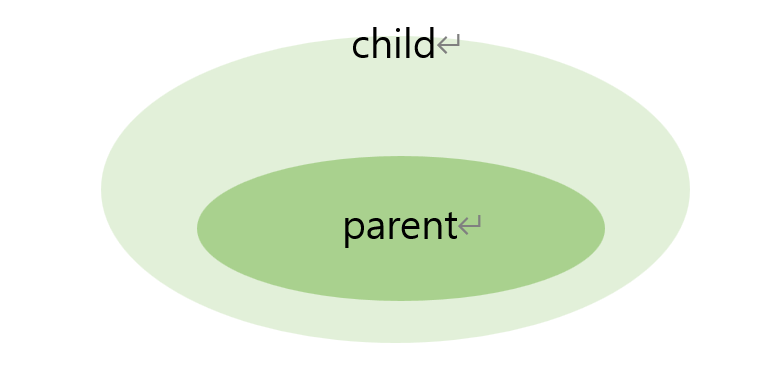
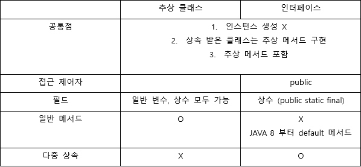

## 상속


### 정의

기존의 클래스를 재사용해서 새로운 클래스 작성

### 특징

코드를 공통적으로 관리해 코드의 추가, 변경이 용이.

코드의 **재사용성 증가, 코드의 중복 제거**로 인해 생산성과 유지 보수에 기여

| 클래스 |  |
| --- | --- |
| 조상 클래스  | 부모 클래스, 상위 클래스 |
| 자손 클래스  | 자식 클래스, 하위 클래스 |



자손 클래스는 **조상 클래스의 모든 멤버 상속** (Child 클래스는 Parent 클래스의 멤버들  포함)

조상 클래스 변경 → 자손 클래스 영향
자손 클래스 변경 → 조상 클래스 영향 X

<aside>
💡 <br/>
- 생성자, 초기화 블럭은 상속 X → 오직 멤버만 상속 <br/>
- 자손 클래스 멤버 개수는 조상 클래스 이상

</aside>

---
<br/>

## 포함 관계


### 정의

한 클래스의 **멤버 변수로 다른 클래스 타입의 참조변수 선언**

```java
class Point{
	int x;
	int y;
}

class Circle{
	// Point c = new Point(); // 원점

	Point center; // Circle 과 Point 는 포함 관계, 원은 점을 가지고 있다.
	int r;
}
```

### 상속과 포함 관계의 차이

| 상속 | ~은 ~이다. (is-a) |
| --- | --- |
| 포함 | ~은 ~을 가지고 있다 (has-a) |
<br/>

### 단일 상속

자바에서는 **단일 상속**만을 허용 ( 둘 이상의 클래스로부터 상속 X)
<br/>


### object클래스

**모든 클래스의 최상위**에 있는 조상 클래스

다른 클래스로부터 상속 받지 않은 모든 클래스들은 자동적으로 Object 클래스로부터 상속

자바의 모든 클래스들은 **Object 클래스들의 멤버들을 상속** 받기 때문에 **Object 클래스에 정의된 멤버 사용 가능**

<br/>

## 오버라이딩

조상 클래스로부터 상속 받은 메서드의 내용 변경

<br/>

### 오버라이딩의 조건

**선언부가 일치 (메서드 이름, 매개 변수, 반환타입이 일치)**

**접근 제외자, 예외는 제한된 조건 하에서 다르게 변경 가능** 
<br/>


- 접근 제어자는 **조상 클래스의 메서드보다 좁은 범위로 변경 불가**
    
    ex. 조상 클래스 - protected 이면 자손 클래스 - protected 이나  public
    
- **조상 클래스의 메서드보다 많은 수의 예외 선언 불가**
    
    ```java
    class Parent{
    	void parentMethod() throws IOException, SQLException{
    	}
    }
    
    // 주의 : 선언된 예외의 개수의 문제가 아니다.
    /* 
    부모 클래스보다 적은 개수의 예외를 선언한 것 처럼 보이지만 
    Exception 은 모든 예외의 최고 조상. 가장 많은 개수의 예외를 던질 수 있도록 선언한 것이 된다.
    */
    class Child extends Parent{
    	void parentMethod() throws Exception{
    
    	}
    }
    ```
    

- **인스턴스 메서드를 static 메서드 또는 그 반대로 변경 불가**

<aside>
💡 <br/>
Q. 조상 클래스에 정의된 static메서드를 자손 클래스에서 같은 이름의 static 메서드로 정의 가능? <br/>
가능하지만 오버라이딩은 아니다! 
각 클래스에서 별개의 static 메서드를 정의한 것일 뿐이다.

</aside>

<br/>

### 오버라이딩 vs 오버로딩

| 오버로딩(overloading) | 오버라이딩(overriding) |
| --- | --- |
| 기존에 없는 새로운 메서드를 정의 | 상속 받은 메서드의 내용을 변경하는 것 |

<br/>

### super

자손 클래스에서 **조상 클래스로부터 상속 받은 멤버를 참조**하는데 사용되는 참조 변수

<u> **static 메서드에서는 사용 불가** </u>, 인스턴스 메서드에서만 사용 가능
<br/>

### super()

**조상 클래스의 생성자를 호출**하는데 사용

자손 클래스의 인스턴스 생성하면 자손 클래스의 생성자에서 조상 클래스 생성자 호출 →

(자손 클래스의 멤버가 조상 클래스의 멤버를 사용할 수 도 있기 때문에 조상의 멤버들이 먼저 초기화 되어 있어야 하므로)

Object 제외한 모든 클래스의 생성자는 **첫줄에** 자신의 생성자 또는 조상의 생성자 호출. 
**컴파일러가 자동으로 super( ) 를 생성자 첫줄에 삽입**

<aside>
💡 생성자가 정의되어 있는 클래스에는 컴파일러가 기본 생성자를 자동적으로 추가하지 X

</aside>

<br/>

<br/>

## package 와 import

### package

클래스의 묶음, 서로 관련된 클래스들끼리 그룹 단위로 묶어서 클래스를 효율적으로 관리 가능

클래스의 실제 이름은 패키지명을 포함한 것

- 하나의 소스 파일에는 **첫번째 문장**에 **단 한번의 패키지 선언**만을 허용
- 모든 클래스는 반드시 하나의 패키지에 포함
- 패키지는 . 을 구분자로 계층 구조 구성 가능
- 패키지는 물리적으로 클래스 파일을 포함하는 하나의 디렉토리

## import

컴파일러에게 소스파일에 사용된 클래스의 패키지에 대한 정보를 제공

같은 패키지 내의 클래스들은 import문을 지정하지 않고도 패키지명 생략 가능

### import.*

지정한 패키지에 속하는 모든 클래스를 패키지 명 없이 사용 가능

> 클래스의 이름 대신 * 를 사용하는 것이 하위 패키지의 클래스까지 포함하는 것은 X
> 

### static import

static멤버를 호출할 때 클래스 이름 생략 가능

```java
import static java.land.Math.random;
import static java.lang.System.out;

class A{
	public static void main(String[] args){
			//System.out.println(Math.random());

			out.println(random());
	}
}
```


## 제어자

접근 제어자와 그외 제어자로 분류 가능

접근 제어자는 4가지 중 하나만 선택 가능
<br/>

### static

클래스의, **공통적**인 의 의미

멤버변수, 메서드, 초기화 블럭에 static이 붙으면 **인스턴스 생성하지 않고도 사용 가능**

<br/>

| static 멤버변수 | static 메서드 |
| --- | --- |
| - 모든 인스턴스에 공통적으로 사용되는 클래스 변수| - 인스턴스를 생성하지 않고 호출 가능 |
|- 클래스 변수는 인스턴스를 생성하지 않고도 사용 가능| - static 메서드 내에서 인스턴스 멤버 직접 사용 |
|- 클래스에 메모리에 로드될때 생성 | 	|


### final
| | 특징 |
| --- | --- |
| 클래스 | 변경될 수 없는 클래스 <br/> 다른 클래스의 조상이 될 수 X |
| 메서드 | 변경될 수 없는 메서드 <br/> 오버라이딩을 통해 재정의 X |
| 멤버 변수, 지역 변수 | 값을 변경할 수 없는 상수 |


final이 붙어 있는 변수는 상수→ 일반적으로 **선언과 동시에 초기화**, 생성자를 통해서 단 한번만 초기화하는 것 가능

```java
class Card{

final int NUMBER;
final String KIND;

	Card(Sting kind, int num){  // 상수 초기화
		KIND = kind;
		NUMBER = num;
	}

}
```

### abstract
| | 특징 |
| --- | --- |
| 클래스 | 클래스 내에 추상 메서드(완성 되지 않은 메서드)가 선언되어 있다<br/> 미완성의 설계도 <br/> 인스턴스 생성 불가 |
| 메서드 | 구현부는 작성하지 않은 추상 메서드 |

<br/>

### 접근제어자

멤버 또는 클래스를 외부에서 접근하지 못하도록 제한하는 역할 수행

|  | 같은 클래스  | 같은 패키지 | 자손 클래스 | 전체 |
| --- | --- | --- | --- | --- |
| public | O | O | O | O |
| protected | O | O | O |  |
| (default) | O | O |  |  |
| private | O |  |  |  |

**접근 제어자 사용하는 이유** 

- 외부로부터 클래스 내부에 선언된 데이터 접근 제한(데이터 감추기, 객체지향 개념의 캡슐화)
- 외부에는 불필요한 부분 감추기

> 하나의 자바 파일에는 public 클래스가 단 하나만 존재 가능
자바 파일의 이름은 반드시 public 클래스의 이름과 일치
> 
<br/>

### 싱글톤 패턴

**생성자 private**으로 설정해 인스턴스의 생성 제한

**인스턴스를 클래스 내부에서 생성**해서 생성된 인스턴스를 반환하는 메서드를 public 으로 제공해 외부에서 해당 클래스의 인스턴스 사용 가능

```java
class Singleton {
	// 클래스 내부에서 생성자 생성
	private static Singleton S = new Singleton();

	// 생성자 private
	private Singleton (){
	}

	public static Singleton getInstance(){
			return S;
	}
}
```

<aside>
💡 생성자가 private 인 클래스는  <u>다른 클래스의 조상이 되는 것 불가 </u> <br/>
(자손 클래스의 인스턴스를 생성할 때 조상 클래스의 생성자를 호출해야 하는데
생성자가 private 면 자손 클래스에서 호출하는 것 불가능) → <br/>
<u>클래스 앞에 final</u> 붙여서 상속할 수 없는 클래스라고 표시하는 것이 좋다.

</aside>

<br/>

### 제어자 주의 사항

- 메서드에 static, abstract 함께 사용 불가
- 클래스에 abstract 과 final 함께 사용 불가
final 은 클래스 확장 불가의 의미, abstract 은 상속을 통해 완성한다는 의미로 모순
- abstract 메서드에 접근 제어자가 private 불가
    
    abstract 메서드는 자손클래스에서 구현해야하는데 private 면 접근 불가
    
- 메서드에 private 과 final 같이 사용할 필요X
    
    접근 제어자가 private인 메서드는 오버라이딩 불가. 하나만 사용해도 충분
    

<br/>

## 다형성

여러 가지 형태를 가질 수 있는 능력

**조상 클래스 타입의 참조변수로 자손 클래스의 인스턴스 참조 가능** 

**자손타입의 참조변수로 조상 타입의 인스턴스 참조는 불가**(존재하지 않는 멤버를 사용할 가능성이 있기 때문)

참조변수가 사용할 수 있는 멤버의 개수는 인스턴스의 멤버의 개수 이하여야 한다.

<br/>

### 참조변수의 형변환

참조 변수의 경우 <u>**서로 상속 관계에 있는 클래스 사이에서만 형변환 가능**</u>

**자손 타입 → 조상 타입 (Up casting) 형변환 생략 가능**

- 조상 타입의 참조변수가 다룰 수 있는 멤버의 개수가 실제 인스턴스가 갖고 있는 멤버의 개수보다 적을 것이 분명

**조상 타입 → 자손 타입(down casting) 형변환 생략 불가**

```java
Class Test{

	public static void main(String args[]){
				Car car = null;

				Volvo v1 = new Volvo();

				Volvo v2 = null;
					
				// car 클래스의 멤버가 아닌 것은 사용 불가
				car = v1;   // car = (Car)v1; 업캐스팅, 형변환 생략

				v2 = (Volvo)car; // 형변환 생략 불가

	}
}
```

형변환은 참조변수의 타입을 변환하는 것. 인스턴스를 변환하는 것 X(인스턴스에 영향X)

**조상 타입의 인스턴스를 자손타입의 참조변수로 참조하는 것은 허용X**

### instanceof 연산자

참조변수가 참조하고 있는 인스턴스의 실제 타입 확인하기 위해 사용

**instanceof 연산의 결과가 true → 형변환 가능**

<br/>


### 참조변수와 인스턴스의 연결

멤버변수가 조상 클래스와 자손 클래스에 **중복으로 정의**된 경우 

- 조상 타입의 참조변수 사용 → 조상 클래스에 선언된 멤버 변수가 사용
- 자손 타입의 참조변수 사용 → 자손 클래스에 선언된 멤버변수가 사용

메서드의 경우 참조변수 타입에 관계 없이 **실제 인스턴스의 메서드가 호출**

<br/>

### 매개변수의 다형성

매개변수에 다형성을 적용하면 하나의 메서드로 자손타입의 참조변수들을 매개변수로 받을 수O

<br/>

### 여러 종류의 객체를 배열로 다루기

조상 타입의 참조변수 배열을 이용하면 공통의 조상을 가진 서로 다른 종류의 객체를 배열에 저장 가능 

> Vector 클래스 - 동적으로 크기가 관리되는 객체 배열
10개 이상의 인스턴스 저장되면 자동으로 크기 증가
내부적으로 Object 타입의 배열을 가지고 있다
> 

<br/>

## 추상 클래스

미완성의 설계도, 추상 메서드 포함

추상 클래스는 상속을 통해 자손 클래스에 의해서만 완성 가능

**abstract** 을 붙이면 된다.

**추상 클래스에 생성자, 멤버변수, 메서드 존재 가능**

<br/>

### 추상 메서드

**abstract 리턴 타입 메서드이름();**

선언부만 작성. 구현부는 작성 X

실제 내용은 상속 받는 클래스에서 구현, **자손 클래스에서 추상메서드를 반드시 구현하도록 강요**

```java
abstract class Player{
		// 추상 메서드
		abstract void play(int pos);
		abstract void stop();
}
```


## 인터페이스

기본 설계도

추상 클래스보다 추상화 정도가 높다

**일반 메서드 또는 멤버변수를 구성원으로 가질 수  X (추상 메서드, 상수만 가능)**

- 모든 멤버변수는 **public static final** 이며 생략 가능
- 모든 메서드는 **public abstract** 이며 생략 가능

인터페이스에 정의된 모든 멤버에 적용되기 때문에 제어자 생략이 가능한 것

생략된 제어자는 컴파일 시에 컴파일러가 자동으로 추가

> JDK 1.8 부터는 인터페이스에 static 메서드, default 메서드 추가 허용
>

<br/>

### 인터페이스의 상속

인터페이스는 **인터페이스로부터만 상속** 가능

인터페이스는 **여러 개의 인터페이스를 다중 상속 가능**

```java
interface Swim{
		void swim();
}
interface Jump{
		
}
class Animal implements Swim, Jump{}
```

### 인터페이스 구현

인터페이스 구현하면 implements 키워드 

인터페이스의 메서드 중 **일부만 구현할 경우 abstract 을 붙여서 추상 클래스로 선언**해야 한다.

상속과 인터페이스 구현 동시에 가능

```java
class Monkey extends Animal implements Jump{
//
}
```

<br/>

### 인터페이스를 이용한 다형성

- 인터페이스 타입의 참조변수로 해당 인터페이스를 **구현한 클래스의 인스턴스 참조** 가능
    
    ```java
    interface Swim{
    	void swim();
    }
    
    class Tiger implements Swim{
    	public void swim(int m){
    		System.out.println(m + " 수영 가능");
    	}
    }
    //Swim s = new Tiger(); 도 가능
    Swim s = (Swim)new Tiger();
    ```
    
- 인터페이스는 **메서드의 매개변수 타입**으로 사용 가능
    
    인터페이스를 구현한 클래스의 인스턴스를 매개변수로 제공
    
    ```java
    // Swim 인터페이스를 구현한 클래스의 인스턴스를 넘겨준다
    public void water(Swim b){
    			
    }
    ```
    

- 리턴 타입을 인터페이스로 지정
    
    해당 인터페이스를 구현한 클래스의 인스턴스를 반환
    
    ```java
    Fightable method(){
    	Fighter f = new Fighter();
    	return f;
    }
    ```
    

### 인터페이스의 장점

1. 개발 시간 단축
2. 표준화 가능
3. 서로 관계 없는 클래스들에게 관계 맺어주기 가능
4. 독립적인 프로그래밍이 가능

<br/>

### 디폴트 메서드

추상 메서드의 기본적인 구현을 제공하는 메서드

디폴트 메서드가 새로 추가되어도 **해당 인터페이스를 구현한 클래스를 변경하지 않아도 된다**.

default 키워드 O,  일반 메서드처럼 { } 가 존재

접근 제어자는 <u>**public 이며 생략 가능**</u>

**새로 추가된 디폴트 메서드가 기존의 메서드 이름과 중복되어 충돌하는 경우**

- 여러 인터페이스의 default 메서드가 충돌하는 경우
    - 구현 클래스에서 디폴트 메서드 재정의
- 조상 클래스의 메서드와 디폴트 메서드 간의 충돌
    - 조상 클래스의 메서드가 상속, 디폴트 메서드는 무시
    
<br/>

## 추상 클래스 VS 인터페이스




<br/>

## 내부 클래스

클래스 내에 선언된 클래스

<br/>

### 내부 클래스의 장점

- 내부 클래스에서 외부 클래스의 멤버들 쉽게 접근 가능
- 외부에는 불필요한 클래스 감추기 가능

<br/>

### 내부 클래스 종류

선언 위치에 따라 구분
| 클래스 | 특징 | 
| --- | --- |
| 인스턴스 클래스 | 외부 클래스의 멤버변수 선언 위치에 선언<br/> 외부 클래스의 인스턴스 멤버처럼 다루어짐|
| 스태틱 클래스 | 외부 클래스의 멤버변수 선언 위치에 선언 <br/>외부 클래스의 static 멤버처럼 다루어짐<br/> static 변수를 선언해야 한다면  스태틱 클래스로 선언해야 한다 |
| 지역 클래스 | 외부 클래스의 메서드나 초기화 블럭 안에 선언<br/> 선언된 영역 내부에서만 사용 |
| 익명 클래스 | 클래스의 선언과 객체의 생성을 동시에 하는 이름 없는 클래스 (일회용) |
